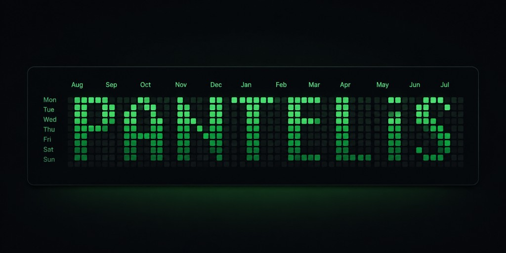
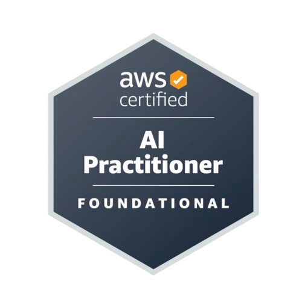
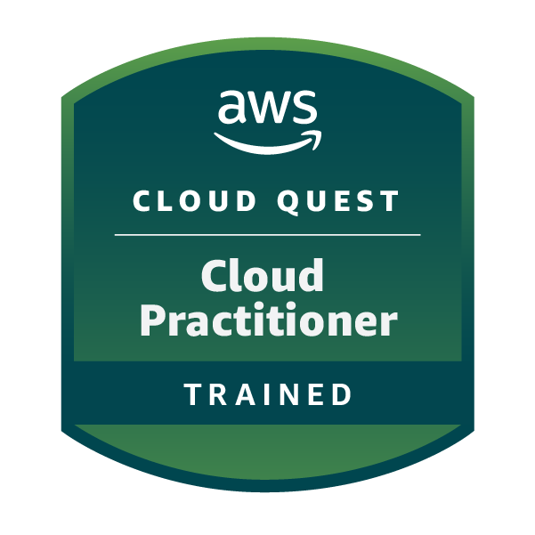
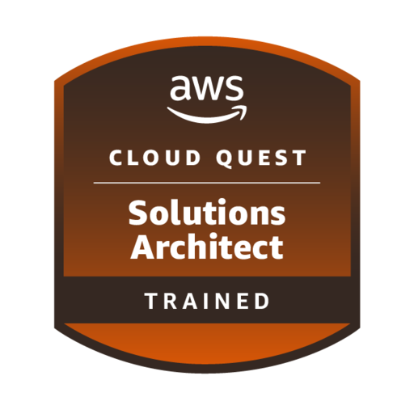
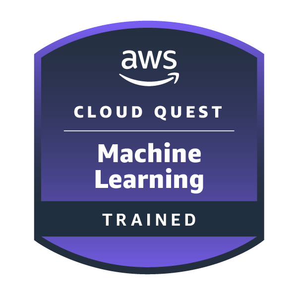

<!-- Banner -->
<!-- markdownlint-disable MD041 -->

## Hi there 👋 

- 👂 My name is **Pantelis Tsagkas**
- 🏳️ Pronouns: **he/him**
- 🔭 I'm currently working on **AWS cloud projects**, **Terraform**, and **SageMaker ML workflows**
- 🌱 I'm currently learning **Terraform in depth**, **AWS cloud services**, and **LLM evaluation**
- 🤝 I'm looking to collaborate on **ETL pipelines**, **data engineering**, and **IaC**
- 🤔 I'm looking for help with **Docker** and **advanced AWS architecture**
- 💬 Ask me about **[Starship & Super Heavy Booster](https://www.spacex.com/vehicles/starship)**
- 📫 How to reach me: **[LinkedIn](https://www.linkedin.com/in/pantelis-t-6a7718249/)** · **[Portfolio](https://pantelis-tsagkas.com)**
- ❤️ I love **shipping real projects** and **documenting what I learn** (like my [Cloud Quest walkthrough](https://pantelistsagkas.github.io/aws-cloud-quest-ml/))
- ⚡ Fun fact: In Git we trust. Everyone else must push.

---

## Connect with Me

---

## About Me

I'm a Test Engineer with a strong interest in distributed systems, cloud infrastructure, observability, and AI engineering. I enjoy understanding how complex systems work beneath the surface, from [Kubernetes](https://kubernetes.io/docs/home/) control planes and consensus algorithms to machine learning pipelines and production infrastructure.

Most of what I build starts with infrastructure as code. I enjoy creating reproducible systems, instrumenting them with proper observability, and documenting everything I learn along the way.

Currently I'm focused on:

* Building cloud infrastructure with AWS and [Terraform](https://developer.hashicorp.com/terraform)
* Exploring [Kubernetes](https://kubernetes.io/docs/home/) internals, distributed systems, and platform engineering
* Developing AI-powered applications using modern [LLMs](https://ollama.com)
* Learning machine learning engineering through Amazon SageMaker
* Sharing detailed technical write-ups and hands-on projects

I prefer building real systems over tutorial projects. Every repository here is something I've designed, deployed, broken, fixed, and documented.

---

## Tools and Cool Stuff

### Languages & frameworks

### Data & cloud

### AI daily drivers

### Quality & AI

### Workflow

---

## Featured Projects

- **[AWS Cloud Quest: ML](https://github.com/PantelisTsagkas/aws-cloud-quest-ml)** — Walkthrough of every ML quest, services used, and how it fits together. [GitHub Pages](https://pantelistsagkas.github.io/aws-cloud-quest-ml/) · [Repo](https://github.com/PantelisTsagkas/aws-cloud-quest-ml)
- **[s3-terraform-cheat-sheet](https://github.com/PantelisTsagkas/s3-terraform-cheat-sheet)** — Terraform cheat sheet hosted on S3 + CloudFront (IaC publishes the asset itself)
- **[golden-fork-pipeline](https://github.com/PantelisTsagkas/golden-fork-pipeline)** — Serverless CSV → DynamoDB ingestion with validation, quarantine alerts, full Terraform IaC
- **[image-resizer-terraform](https://github.com/PantelisTsagkas/image-resizer-terraform)** — Presigned uploads, S3-triggered Lambda, three resized variants — zero console clicks
- **[termref](https://github.com/PantelisTsagkas/termref)** — AI-powered terminal cheat sheet generator
- **[AskBetter](https://www.askbetter.co.uk)** — **Live** prompt enhancement product. [Site](https://www.askbetter.co.uk)
- **[Portfolio](https://pantelis-tsagkas.com)** — Personal site, blog, and project hub. [Live](https://pantelis-tsagkas.com)
- **[AMZN Tracker](https://github.com/PantelisTsagkas/amzn_tracker)** · **[Diane - Guide for Lesvos](https://github.com/PantelisTsagkas/diane_guide_for_lesvos)** · **[Georgia Yfanti - Dentist](https://georgia-yfanti.vercel.app)** — Earlier Next.js builds

---

## Certifications

Exam-based credentials (paid certification exams).

<table>
  <tr>
    <td width="120">
      
    </td>
    <td>
      <strong><a href="https://www.credly.com/badges/35530fa2-1b3c-4e7a-a6f9-91f3d6ee8a6f/public_url">AWS Certified AI Practitioner</a></strong> — June 2025 
      Foundational AI, ML, and AWS AI services.
    </td>
  </tr>
</table>

---

## Courses & Training

Hands-on Cloud Quest roles, learning paths, and completed courses.

### AWS Cloud Quest

<table>
  <tr>
    <td width="120">
      
    </td>
    <td>
      <strong><a href="https://www.credly.com/badges/f839cd12-fe61-4635-8c5a-153dca7458d2/public_url">AWS Cloud Quest: Cloud Practitioner</a></strong> — June 2026 
      Fundamental AWS Cloud concepts with hands-on experience across compute, networking, database, and security services.
    </td>
  </tr>
  <tr>
    <td width="120">
      
    </td>
    <td>
      <strong><a href="https://www.credly.com/badges/3b195cea-112f-4b2c-b367-bccabcf82bfc/public_url">AWS Cloud Quest: Solutions Architect</a></strong> — June 2026 
      Solution building with a broad set of AWS services — secure, fault-tolerant, and highly available architectures.
    </td>
  </tr>
  <tr>
    <td width="120">
      
    </td>
    <td>
      <strong><a href="https://www.credly.com/badges/a0ebca5c-01b3-4909-aabc-f57aec2df59a/public_url">AWS Cloud Quest: Machine Learning</a></strong> — June 2026 
      Hands-on solution building with AWS ML/AI services, including SageMaker model build, test, and deploy.
    </td>
  </tr>
</table>

### Completed courses

<table>
  <tr>
    <td width="120">
      
    </td>
    <td>
      <strong><a href="https://www.udemy.com/certificate/UC-7854b6e8-411d-4fb6-962f-4ffde07c7e3d/">AI Engineer Core Track: LLM Engineering, RAG, QLoRA, Agents</a></strong> · Ed Donner 
      <a href="https://www.udemy.com/certificate/UC-7854b6e8-411d-4fb6-962f-4ffde07c7e3d/">View certificate</a>
    </td>
  </tr>
  <tr>
    <td width="120">
      
    </td>
    <td>
      <strong><a href="https://certificates.cs50.io/8b0a42da-511a-4d90-ae65-3df40ec794d9.pdf?size=letter">CS50x — Introduction to Computer Science</a></strong> · Harvard University 
      <a href="https://certificates.cs50.io/8b0a42da-511a-4d90-ae65-3df40ec794d9.pdf?size=letter">View certificate</a>
    </td>
  </tr>
  <tr>
    <td width="120">
      
    </td>
    <td>
      <strong><a href="https://www.credly.com/badges/2a6b4e76-e06e-42c5-b5ce-baab62253e3c/public_url">Artificial Intelligence Fundamentals</a></strong> · IBM SkillsBuild 
      AI concepts, ethics, Watson Studio, and applications across NLP, CV, and ML.
    </td>
  </tr>
  <tr>
    <td width="120">
      
    </td>
    <td>
      <strong><a href="https://verify.skilljar.com/c/ju8fisjqds8w">AI Fluency: Framework & Foundations</a></strong> · Anthropic Academy — April 2026 
      <a href="https://verify.skilljar.com/c/ju8fisjqds8w">Verify certificate</a>
    </td>
  </tr>
  <tr>
    <td width="120">
      
    </td>
    <td>
      <strong>Learn Terraform quickly, easily and effectively</strong> · Udemy 
      <em>Certificate link coming soon</em>
    </td>
  </tr>
</table>

---

## GitHub Stats

---

Turning rough ideas into reproducible cloud stacks — and models that actually deploy.
